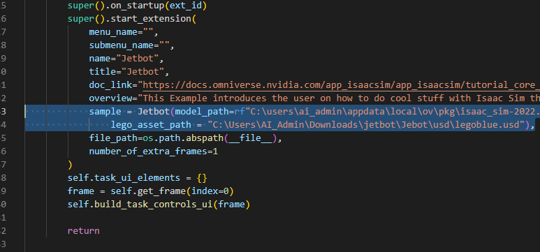
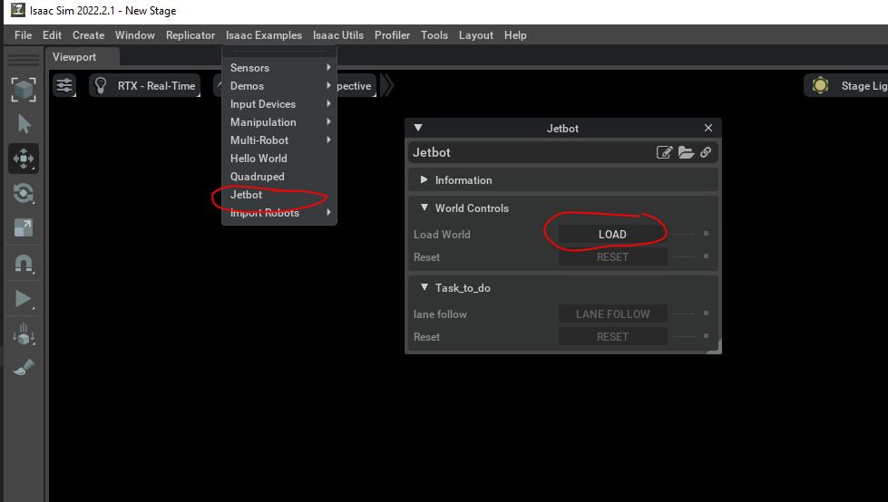

# Jebtot Lane Follow in Isaac Sim (Virtual Jetbot)

Jebtot Lane Follow in Isaac Sim is a short project that focuses on implementing lane-following capabilities for a virtual Jetbot using NVIDIA Isaac Sim. Isaac Sim is a powerful simulator for developing and testing robotics algorithms.

## Project Overview

The goal of this project is to enable a virtual Jetbot to navigate and follow lanes using computer vision techniques within the Isaac Sim environment. By analyzing the simulated camera feed, the algorithm detects the lanes and controls the virtual robot's movement to stay within them. This project provides a simulated environment for developing and testing lane-following algorithms without the need for physical hardware.

## Prerequisites

- Omniverse Isaac Sim: Install and set up Isaac Sim on your machine. (Isaac isaac_sim-2022.2.1)
- Installation requirements: pytorch, torchvision

## Table of Contents
- [Installation](#installation)
- [Generate Dataset](#generate-dataset)
- [Data Processing](#data-processing)
- [Training](#training)
- [Quick Start](#quick-start-deploying-the-trained-model)
- [Creating your own lego path](#creating-your-own-lego-path)
- [Disclaimer](#disclaimer-things-to-keep-in-mind)

## Installation

To install the project and its dependencies, execute the following commands:

path of the python.bat file "appdata\local\ov\pkg\isaac_sim-2022.2.1"

```shell
# Install the dependencies in Omniverse Isaac Sim 
python.bat -m pip install torch==1.13.1+cu117 torchvision==0.14.0+cu117 opencv-python==4.7.0.72 numpy==1.21.6 matplotlib==3.4.3

```


Clone or download this repository and change into the directory:

```
cd ISAAC_SIM_JETBOT
```
## Creating your own lego path

Please follow the instructions from this link for path creation
[[Lego Path]](https://blog.cavedu.com/2021/10/22/nvidia-isaac-sim-rl-jetbot/)


## Generate Dataset

Dataset is created on a simple lego path shown below. 

1. Copy the files from `.\omniverse_data_extraction` into the `user_examples` folder in Isaac Sim (path: `appdata\local\ov\pkg\isaac_sim-2022.2.1\exts\omni.isaac.examples\omni\isaac\examples\user_examples\`).

2. Run the files in Isaac Sim (see image below).

3. Make the necessary changes for the paths of the pretrained model and lego asset path in `Jetbot_extension.py` and `save_image` in `Jetbot.py`.




4. Press play in Isaac Sim. (Here the direction of the jetbot is preset using articulation controller making changes or creating a new path required an understanding of framerate and trial and error)



## Data Processing

Current dataset structure

Images_path/
├── images_datset_captured/
│   ├── images_4.png
│   └── ...
├── images_with_circle/
│   ├── xy_68_122_UUID.jpg
│   ├── xy_69_121_40baf7a9-4072-48c8-bc7b-ff96d03eea12.jpg
│   └── ...
├── images_xy/
│   ├── xy_68_122_UUID.jpg
│   ├── xy_69_121_40baf7a9-4072-48c8-bc7b-ff96d03eea12.jpg
│   └── ...
└── README.md


The dataset is passed to image processing, where the x and y of the furthest point in the lane are detected and stored for each image in its file name with a unique id. The approach is similar to the lane following dataset collection but automated. [[Data_Collection]](https://github.com/NVIDIA-AI-IOT/jetbot/blob/master/notebooks/road_following/data_collection.ipynb)

To prepare the data, follow these steps:

1. Dataset: `./images_path/image_dataset_captured`
2. Preprocess using our lane detect script:
   - Provide the path of the three folders: `image_dataset_captured`, `images_xy`, and `images_with_circle`.

```shell
python computer_vision_code/lane_detect.py image_dataset_captured=path_to\image_dataset_captured images_xy=path_to_\images_xy images_with_circle=path_to\images_with_circle
```

Each image will be opened with three windows. Press Enter for each image to be processed and stored. Press 'q' to quit.

## Training

Follow the training code from the following git repository: [Lane Follow](https://github.com/NVIDIA-AI-IOT/jetbot/blob/master/notebooks/road_following/train_model.ipynb)

## Quick start-Deploying the trained model

Quickly use the pretrained model:

If you do not want to train using the dataset, you can directly use the pretrained model provided in the path: `model_path\best_steering_model_xy.pth` 
or use the model from the traine

1. Copy the files from `.\omniverse_pretrained` into the `user_examples` folder in Isaac Sim (path: `appdata\local\ov\pkg\isaac_sim-2022.2.1\exts\omni.isaac.examples\omni\isaac\examples\user_examples\`).

2. Run the files in Isaac Sim.

3. Make the necessary changes for the path of the pretrained model.

4. Press play in Isaac Sim.


## Examples

Here you can see the pretrained model was used for self-driving for a simple path:


Here you can see the pretrained model was used for self-driving for a complex path:


## Related Works

Please also check out our related projects!

- [NVIDIA JETBOT](https://github.com/NVIDIA-AI-IOT/jetbot)

## Disclaimer-Things to keep in mind
- providing large amount of data for good training is important, since the model was trained on a simple path it could be that training on complex path may be combersome even though it performs good. Using Reinforcement learning or other NVidia ROS SLAM functionalies would be the way to go for better navigation for unknown paths.
- Scale of usd files makes a lot of difference. Please thread csrefully with the size since the weight shfit and other properties make it difficult to navigate.
- differential controller is used for navigating from one point to the other with set of goal positions but around the curves it does not do a good job.
- Articulation controller is used for controlling each wheel speed so is much easier for a prediction model.
- dataset to be changes according to the framerate so deeper understanding of articulation contoriller needed.
- data creation
